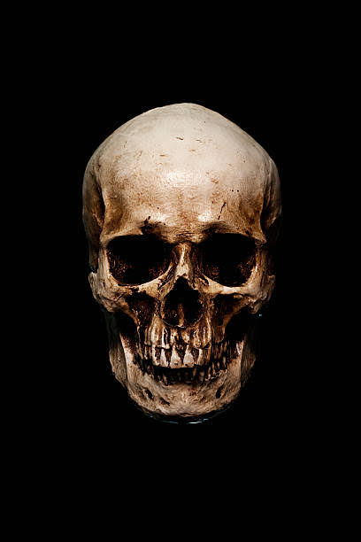
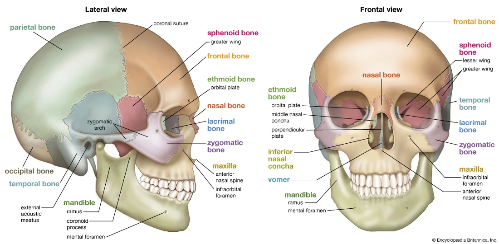

<html>
<head>
  <meta http-equiv="CONTENT-TYPE" content="text/html; charset=UTF-8">
  <title>Science and Tech</title>
  <button> <a href="homework.html">Home</a></button>
  <button> <a href="Aboutus.html">About us</a></button>
  
</head>
<body>
  <h1>
    The Skull
  </h1>
  
  
  
  <pre> skull
anatomy
Also known as: neurocranium
Written and fact-checked by 
Last Updated: Jul 3, 2023 • Article History</pre> 

  
 skull, skeletal framework of the head of vertebrates, composed of bones or cartilage, which form a unit that protects the brain and some sense organs.
    The upper jaw, but not the lower, is part of the skull. The human cranium, the part that contains the brain, is globular and relatively large in comparison with the face. In most other animals the facial portion of the skull, including the upper teeth and the nose, is larger than the cranium.
    In humans the skull is supported by the highest vertebra, called the atlas, permitting nodding motion. The atlas turns on the next-lower vertebra, the axis, to allow for side-to-side motion.
    
    

  
  
   
  <button style="background-color: whitesmoke;"><a href="class1.html">learn more about the skull</a> </button>
</body>
</html>
